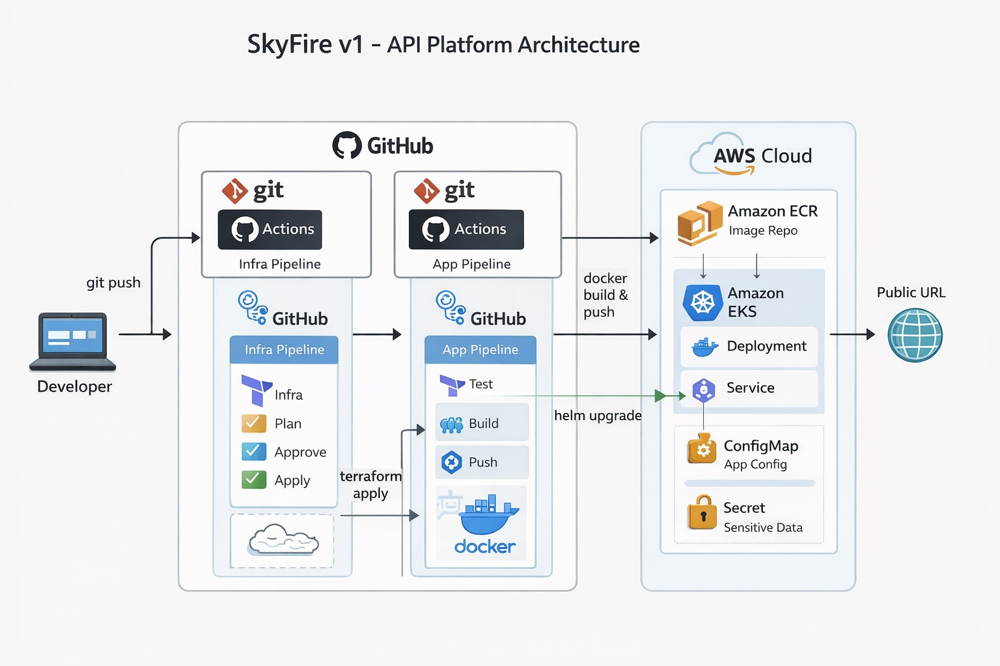

# SkyFire
Cloud/DevOps platform project demonstrating a Python API deployed to AWS EKS using Infrastructure as Code and CI/CD (Terraform, Docker, GitHub Actions, Helm).

## Architecture Diagram

SkyFire v1 is powered by a modern DevOps pipeline. Here’s how it works:

This diagram shows the full CI/CD lifecycle, from a developer git push to automated build, containerization, and deployment on AWS EKS.

### Purpose 

SkyFire v1 is a small platform project I am building to better understand how real cloud systems are deployed.

The application itself is intentionally simple. The main purpose of this project is to practice what I have learned so far about infrastructure, automation, and deployment, and to deploy an application the same way a real company would do it in production.

My main focus is on how things are built, automated, and deployed rather than on application features. This project may look messy at times, but it is just the beginning. The goal is not to have ChatGPT generate everything, but to rely on documentation and tooling to fully understand what I am creating.